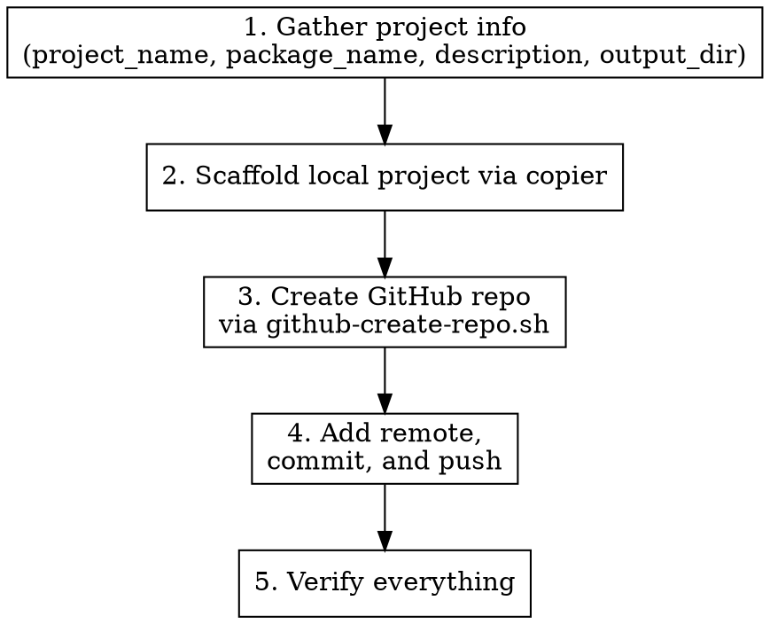

# Bootstrap Python Project

## Overview

End-to-end Python project bootstrapping: scaffolds locally using copier with the [copier-py](https://github.com/ryankanno/copier-py) template, creates a private GitHub repository with consistent settings, and pushes the initial commit.

## When to Use

- User asks to create, bootstrap, set up, or start a new Python project
- User mentions copier, cookiecutter, cruft, or project templates for Python
- User wants a new GitHub repo for a Python project

## Workflow



### Step 1: Gather Project Info

Use `AskUserQuestion` to collect:
- **project_name**: Human-readable name (e.g. "My Awesome Library")
- **package_name**: Python package name in snake_case (e.g. `my_awesome_library`). Must match `^[a-z][a-z0-9_]*$`.
- **project_short_description**: One-line description
- **output_dir** (optional): Where to create the project (defaults to current directory). Maps to copier's `--dst-path` or the positional destination argument.
- **repo_name** (optional): GitHub repo name if different from `package_name` (defaults to `package_name` with underscores replaced by hyphens)

Infer author info from `git config user.name` and `git config user.email`.

### Step 2: Scaffold Local Project

Pass all gathered/inferred values via `--data` flags, then run:

```bash
uv run --with copier copier copy \
  --defaults \
  --data 'author_name=...' \
  --data 'author_email=...' \
  --data 'project_name=...' \
  --data 'project_short_description=...' \
  --data 'project_url=https://github.com/<owner>/<repo-name>' \
  --data 'project_license=MIT' \
  --data 'github_repository_owner=...' \
  --data 'package_name=...' \
  --data 'version=0.0.0' \
  --data 'python_version=3.12' \
  --data 'supported_python_versions=3.10, 3.11, 3.12, 3.13, pypy3.10, pypy3.11' \
  --data 'uv_version=0.7.3' \
  --data 'tox_version=4.25.0' \
  --data 'sphinx_theme=furo' \
  --data 'should_use_direnv=true' \
  --data 'should_create_author_files=true' \
  --data 'should_install_github_dependabot=true' \
  --data 'should_automerge_autoapprove_github_dependabot=true' \
  --data 'should_install_github_actions=true' \
  --data 'should_upload_coverage_to_codecov=false' \
  --data 'should_publish_to_testpypi=false' \
  --data 'should_publish_to_pypi=false' \
  --data 'should_publish_to_github_packages=false' \
  --data 'should_attach_to_github_release=false' \
  https://github.com/ryankanno/copier-py \
  <destination-path>
```

The destination path is the desired output directory (e.g. `./<package_name>` or a user-specified path). Copier creates the directory if it does not exist.

**Note:** The copier template has a `_tasks` section that automatically runs `git init` in the generated project directory after copying.

#### Template Variables Reference

| Variable | Type | Default | Notes |
|----------|------|---------|-------|
| `author_name` | str | Ryan Kanno | Infer from `git config user.name` |
| `author_email` | str | ryankanno@localkinegrinds.com | Infer from `git config user.email` |
| `project_name` | str | — | **Must ask user** |
| `project_short_description` | str | — | **Must ask user** |
| `project_url` | str | — | Construct from owner + repo_name |
| `project_license` | str | MIT | Use default unless user specifies |
| `github_repository_owner` | str | ryankanno | Infer from git config or ask |
| `package_name` | str | — | **Must ask user** (snake_case, validated: `^[a-z][a-z0-9_]*$`) |
| `version` | str | 0.0.0 | Use default |
| `python_version` | str | 3.12 | Use default unless user specifies |
| `supported_python_versions` | str | 3.10, 3.11, 3.12, 3.13, pypy3.10, pypy3.11 | Use default |
| `uv_version` | str | 0.7.3 | Use default |
| `tox_version` | str | 4.25.0 | Use default |
| `sphinx_theme` | str (choice) | furo | Choices: furo, sphinx-rtd-theme, sphinx-book-theme, pydata-sphinx-theme, sphinx-press-theme, piccolo-theme, sphinxawesome-theme, sphinx-wagtail-theme, alabaster, agogo, bizstyle, classic, haiku, nature, pyramid, scrolls, sphinxdoc, traditional |
| `should_use_direnv` | bool | true | Use default |
| `should_create_author_files` | bool | true | Use default |
| `should_install_github_dependabot` | bool | true | Use default |
| `should_automerge_autoapprove_github_dependabot` | bool | true | Only applies when `should_install_github_dependabot` and `should_install_github_actions` are both true |
| `should_install_github_actions` | bool | true | Use default |
| `should_upload_coverage_to_codecov` | bool | false | Only applies when `should_install_github_actions` is true |
| `should_publish_to_testpypi` | bool | false | Only applies when `should_install_github_actions` is true |
| `should_publish_to_pypi` | bool | false | Only applies when `should_install_github_actions` is true |
| `should_publish_to_github_packages` | bool | false | Only applies when `should_install_github_actions` is true |
| `should_attach_to_github_release` | bool | false | Only applies when `should_install_github_actions` is true |

### Step 3: Create GitHub Repo

```bash
~/scripts/github-create-repo.sh <repo-name>
```

The repo name defaults to `package_name` with underscores replaced by hyphens (e.g. `my_awesome_library` → `my-awesome-library`).

**Settings applied by the script:**
- Private repository
- Merge: squash, merge, rebase all enabled; auto-merge on; delete branch on merge
- Features: issues, wiki, projects enabled; discussions disabled
- Actions: enabled, all actions allowed
- Branch ruleset on main: required signatures, linear history, PR reviews (1 approval), code owner review

### Step 4: Add Remote, Commit, and Push

Since copier's `_tasks` already runs `git init`, skip that step:

```bash
cd <project-dir>
git remote add origin git@github.com:<owner>/<repo-name>.git
git add -A
git commit -m "feat: initial project scaffold

Generated from copier-py template via copier."
git push -u origin main
```

**Important:** The branch ruleset requires signed commits. Ensure git config has GPG/SSH signing configured.

### Step 5: Verify

- Confirm local project directory exists with expected files
- Confirm GitHub repo is accessible: `gh repo view <owner>/<repo-name>`
- Confirm push succeeded: `git log --oneline -1`

## Common Mistakes

- **Forgetting `--defaults`**: Without it, copier prompts interactively which breaks automation
- **Using `y`/`n` instead of `true`/`false`**: Copier uses proper booleans, not string flags
- **Invalid `package_name`**: Must match `^[a-z][a-z0-9_]*$` (snake_case, no hyphens, starts with letter)
- **Running `git init` manually**: Copier's `_tasks` already handles this — running it again is harmless but redundant
- **Pushing before repo exists**: Always create the GitHub repo before pushing
- **Unsigned commits**: The branch ruleset enforces required signatures — push will be rejected if commits aren't signed
- **Not authenticated with gh**: Run `gh auth login` first
- **Conditional variables**: `should_automerge_autoapprove_github_dependabot` only applies when both dependabot and actions are enabled; coverage/publishing options only apply when actions are enabled
