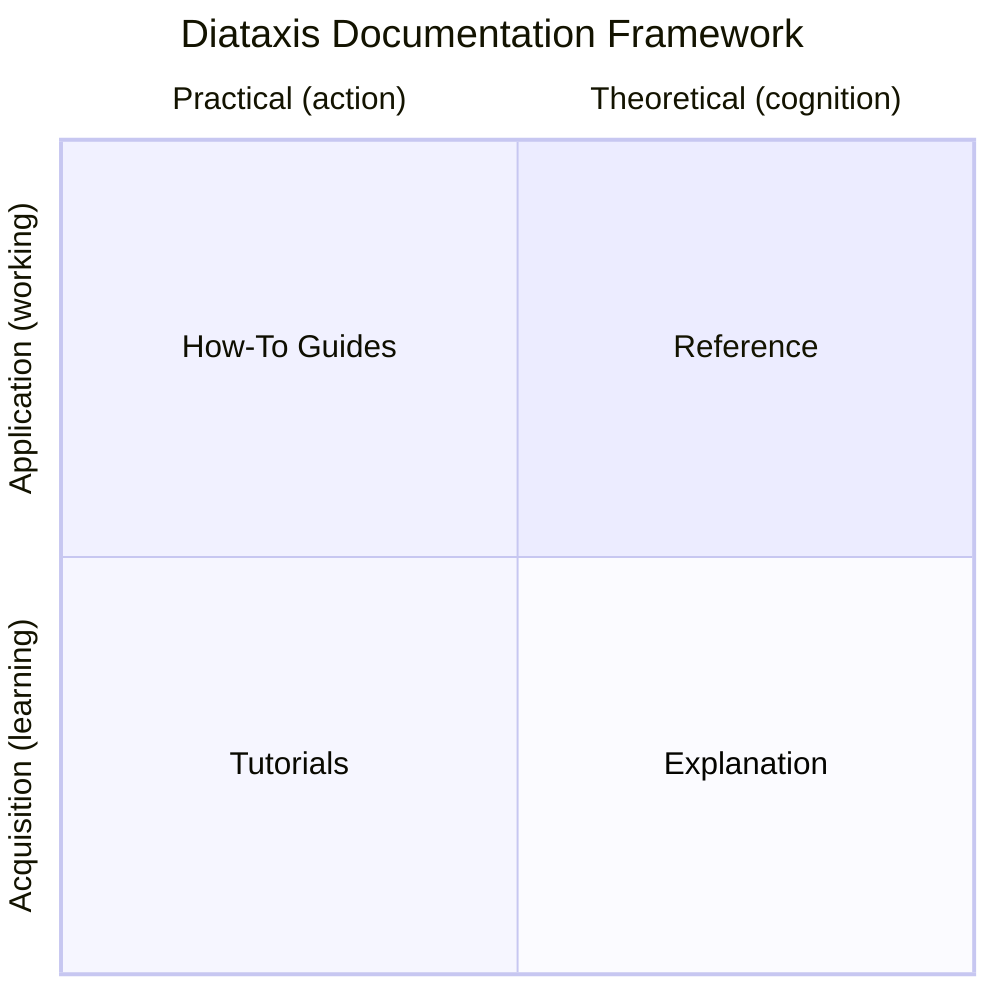

# Documentation Guide Patterns

## What a DOCUMENTATION_GUIDE.md Is

A `DOCUMENTATION_GUIDE.md` is a **meta-reference document** that codifies the Diataxis framework for a specific project. It tells AI assistants and engineers exactly how to write documentation for that repository. It is itself a Reference document (Diataxis quadrant: information-oriented, serves skill application).

Every project with a `docs/` directory should have a `DOCUMENTATION_GUIDE.md` in that directory.

## When to Generate

Generate a `DOCUMENTATION_GUIDE.md` when:
- Creating a new project's documentation from scratch
- Onboarding a project to Diataxis for the first time
- The project has docs but no consistency or standards
- The user explicitly asks for one

## Structure Template

```markdown
# Documentation Guide: [Project Name]

**Audience**: AI assistants and engineers writing documentation for this repository.
**Framework**: Diataxis (https://diataxis.fr), the state-of-the-art documentation framework (2026).
**Rendering target**: [GitHub / Azure DevOps Wiki / GitLab / etc.]

This meta-reference document defines the structure, standards, and specifications
for all documentation in the `[repo-name]` repository. Every file in `docs/` must
conform to the rules described here.

---

## 1. The Diataxis Framework

[Include the quadrant chart and summary table, customized with this project's examples]

## 2. The Four Documentation Types in Detail

### 2.1 Tutorials
[Rules for tutorials in this project]

### 2.2 How-To Guides
[Rules for how-to guides in this project]

### 2.3 Reference
[Rules for reference docs in this project]

### 2.4 Explanation
[Rules for explanation docs in this project]

## 3. Anti-Patterns: What NOT to Do

[Project-specific anti-patterns]

## 4. File Structure for This Repository

[Exact file list with quadrant assignments]

## 5. README.md: The Landing Page Pattern

[README template for this project]

## 6. Detailed Spec for Each Documentation File

[Per-file specifications: title, quadrant, sections, content guidance]

## 7. Mermaid Diagrams: Best Practices

[Diagram standards for this project's rendering target]

## 8. Writing Style Guide

[Tone, tense, formatting rules]

## 9. [Platform] Markdown Compatibility

[Platform-specific rendering notes]

## 10. Repository Context: What This Project Actually Does

[Brief project description so AI assistants understand the domain]
```

## Rules for Generating

### 1. Read the Project First

Before generating a DOCUMENTATION_GUIDE.md, read:
- The existing codebase structure
- Any existing docs
- README.md
- CLAUDE.md (if present)
- Key source files to understand the domain

### 2. Assign Every File to a Quadrant

Map each documentation file to exactly one Diataxis quadrant:

```markdown
| File | Quadrant | Purpose |
|------|----------|---------|
| `getting-started.md` | Tutorial | Walk through first setup |
| `how-to-deploy.md` | How-To Guide | Deploy to environments |
| `configuration.md` | Reference | All config options |
| `architecture.md` | Explanation | System design rationale |
```

### 3. Write Per-File Specs

For each documentation file, specify:
- **Title**: exact heading
- **Quadrant**: which Diataxis type
- **Sections**: expected section headings
- **Must include**: required content
- **Must NOT include**: content that belongs in other files
- **Connects to**: cross-references to other files

### 4. Include the Quadrant Chart

Always include the Mermaid quadrant chart showing the two axes. Use the fence syntax that matches the rendering target (` ```mermaid ` for GitHub/GitLab, `::: mermaid` for Azure DevOps):

````markdown

````

### 5. Customize Anti-Patterns for the Project

Generic anti-patterns from core.md apply, but add project-specific ones:

```markdown
- Do NOT include internal infrastructure names (catalog paths, index names)
  in user-facing docs. Use generic descriptions instead.
- Do NOT document SQL queries inline — link to the sql/ directory.
- Do NOT mix Spanish and English in the same document.
```

### 6. Specify the Rendering Target

Different platforms have different Markdown rendering capabilities:

| Platform | Mermaid Syntax | Admonitions | HTML | Tabs |
|----------|---------------|-------------|------|------|
| GitHub | ` ```mermaid ` | No (use bold) | Limited | No |
| GitLab | ` ```mermaid ` | No (use bold) | Limited | No |
| Azure DevOps Wiki | `::: mermaid` | `:::` syntax | Yes | No |
| Azure DevOps Repos | `::: mermaid` | No | Limited | No |

Include platform-specific notes in the guide.

### 7. Include Project Context

The DOCUMENTATION_GUIDE.md must include a brief description of what the project does. This is essential for AI assistants who need domain context to write accurate docs.

## Common Mistakes in Documentation Guides

1. **Too generic** — a guide that could apply to any project is useless. Include project-specific file specs.
2. **Missing per-file specs** — the guide should specify the exact sections each file must contain.
3. **No quadrant assignments** — every file must be mapped to a quadrant.
4. **No anti-patterns** — project-specific anti-patterns prevent the most common mistakes.
5. **No rendering target** — Mermaid syntax and formatting vary by platform.
6. **No project context** — AI assistants need to understand what the project does to write good docs.
