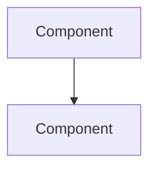

# Explanation Patterns

## What Explanation Is

Explanation provides **context, background, and reasoning**. It answers "why?" and helps the reader understand the bigger picture. Explanation is discursive — it circles around its subject, approaches from different angles, and connects concepts.

Explanation is NOT reference. It interprets and reasons; reference describes.

## Structure Templates

### Architecture Document

```markdown
# Architecture

[Opening paragraph: what this document explains and why the system is shaped the way it is.]

## Overview

[High-level description of the system and its purpose.]

## [Design tension or key concept]

[Explain the fundamental trade-off or constraint that shapes the architecture.]

## [Component/subsystem]

[How this part works and WHY it was designed this way.]

## [How things connect]

[Data flow, integration points, ecosystem context.]
```

### Design Decisions Document (ADR Format)

```markdown
# Design Decisions

## ADR-1: [Decision Title]

### Context

[The situation and constraints that motivated the decision.]

### Decision

[What was decided and how it works.]

### Alternatives Considered

- **[Alternative 1]**: [Why it was rejected]
- **[Alternative 2]**: [Why it was rejected]

### Consequences

[What followed from this decision — both benefits and trade-offs.]
```

## Rules

### Explain Why, Not Just What

The distinguishing feature of explanation is **reasoning**. Every section should answer "why is it this way?" not just "what is it?"

```markdown
<!-- CORRECT: Explains reasoning -->
The system uses two extraction strategies because neither alone is sufficient.
QR scanning provides government-verified data but not all pages have QR codes.
AI extraction handles any document format but is probabilistic.

<!-- WRONG: Just describes what exists -->
The system has two extraction strategies: QR scanning and AI extraction.
```

### Circle Around the Subject

Unlike reference (linear, structured) or how-to guides (step-by-step), explanation can approach a topic from multiple angles:

1. Start with the problem the design solves
2. Explain the constraints that shaped the solution
3. Describe what was tried and rejected
4. Show how the pieces fit together
5. Discuss trade-offs and consequences

### Connect to the Broader Context

Explanation should show how things relate to each other and to the larger system:

- How does this component fit in the ecosystem?
- What upstream/downstream systems does it interact with?
- What historical decisions led to the current design?
- What would need to change if requirements shifted?

### Opinions Are Allowed

Unlike reference (which is neutral), explanation can contain opinions and perspectives:

```markdown
This complexity is justified by the data quality improvement:
QR-sourced data is always accurate, while AI-extracted data
requires downstream validation.
```

### Use ADR Format for Decisions

Architecture Decision Records (ADRs) are the best format for design decisions:

- **Context**: Why the decision was needed
- **Decision**: What was chosen
- **Alternatives Considered**: What was rejected and why
- **Consequences**: What followed — benefits AND trade-offs

Number ADRs for easy reference (ADR-1, ADR-2, etc.).

## Common Mistakes in Explanation

1. **Just describing what exists** — "The system has three agents" → Explain WHY three agents instead of one or two.
2. **Including step-by-step instructions** — "To configure this, run..." → That is a how-to guide.
3. **Including field-level details** — "The `batch_size` field accepts integers from 1-100" → That is reference.
4. **Missing alternatives** — ADRs without "Alternatives Considered" fail to explain WHY this choice was made over others.
5. **No trade-offs** — Every design decision has trade-offs. Omitting them makes the explanation incomplete.
6. **Writing for the author, not the reader** — Explanation should help the reader understand, not justify the author's choices.

## Mermaid Diagrams in Explanation

Explanation docs are the primary place for architectural diagrams. Use Mermaid for:

- **System overview**: `flowchart TD` showing major components and data flow
- **Sequence diagrams**: showing request flow through the system
- **Entity relationships**: `erDiagram` for data model relationships
- **State diagrams**: `stateDiagram-v2` for lifecycle and status transitions
- **Class diagrams**: `classDiagram` for service hierarchies

Use the Mermaid fence syntax that matches your rendering target — ` ```mermaid ` for GitHub/GitLab, `::: mermaid` for Azure DevOps:

````markdown

````

## Connecting to Other Quadrants

Within explanation docs, link to:
- **Reference**: "For the full schema, see [Data Models](data-models.md)"
- **How-to guides**: "For practical deployment steps, see [How to Deploy](how-to-deploy.md)"
- **Tutorial**: "For a hands-on introduction, see [Getting Started](getting-started.md)"
