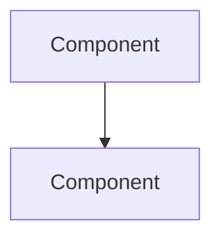

# Writing Style

## Tone and Voice

### Direct and Precise

Write in active voice. Lead with the subject. Avoid hedging language.

```markdown
<!-- CORRECT -->
The pipeline processes each provider independently.

<!-- WRONG -->
It should be noted that the pipeline will generally process each provider independently.
```

### Explain Why, Then What

When explaining design choices, lead with the motivation:

```markdown
<!-- CORRECT -->
The system uses two extraction strategies because neither alone is sufficient.
QR scanning provides government-verified data but fails on damaged codes.
AI extraction handles any format but is probabilistic.

<!-- WRONG -->
The system has two extraction strategies: QR scanning and AI extraction.
QR scanning uses QReader. AI extraction uses Azure OpenAI.
```

### Present Tense

Use present tense for how things work. Use past tense only for historical context in ADRs.

```markdown
<!-- CORRECT -->
The orchestrator classifies intent and delegates to sub-agents.

<!-- WRONG -->
The orchestrator will classify intent and will delegate to sub-agents.
```

### Second Person for Guides, Third Person for Explanation

- Tutorials and how-to guides: "you" (addressing the reader directly)
- Reference: impersonal (describe the system, not the reader)
- Explanation: "the system", "the pipeline" (third person)

---

## Formatting Standards

### Headings

- `#` for the page title (one per page)
- `##` for major sections
- `###` for subsections
- `####` sparingly — if you need `#####`, restructure instead
- Sentence case: "How the pipeline works" not "How The Pipeline Works"

### Code Blocks

Always specify the language for syntax highlighting:

````markdown
```python
def process(items: list[str]) -> None:
    ...
```

```bash
databricks auth profiles
```

```sql
SELECT * FROM catalog.schema.table LIMIT 10
```

```yaml
providers:
  - provider_id: "00000000071545"
```
````

### Tables

Use tables for structured data. Align columns for readability in source:

```markdown
| Field | Type | Default | Description |
|-------|------|---------|-------------|
| `host` | `str` | `"0.0.0.0"` | Server bind address |
| `port` | `int` | `8000` | Server port |
```

### Lists

- Use numbered lists for sequential steps (tutorials, how-to guides)
- Use bullet lists for unordered items (features, options, considerations)
- Keep list items parallel in structure

### Links

Use relative links between docs in the same `docs/` directory:

```markdown
For details, see [Architecture](architecture.md).
For deployment steps, see [How to Deploy](how-to-deploy.md).
```

### Admonitions / Callouts

Use bold text for inline callouts when the rendering target does not support admonition syntax:

```markdown
**Important**: The migration runs automatically on first boot.

**Note**: This requires Python 3.12 or later.
```

---

## Mermaid Diagrams

### When to Use Diagrams

- **Architecture docs**: system overview, data flow, component relationships
- **Design decisions**: showing alternatives or trade-offs visually
- **Data models**: entity relationships
- **Pipeline docs**: stage sequences, state transitions

### Syntax Convention

Use the Mermaid fence syntax that matches your rendering target:

**GitHub / GitLab** (triple-backtick):
````markdown

````

**Azure DevOps Wiki / Repos** (`:::` fenced):
```markdown
::: mermaid
flowchart TD
    A[Component] --> B[Component]
:::
```

### Diagram Types

| Diagram Type | Mermaid Syntax | Use For |
|-------------|---------------|---------|
| System flow | `flowchart TD` | Architecture overview, data flow |
| Sequence | `sequenceDiagram` | Request flow, API interactions |
| Entity relationship | `erDiagram` | Database schema |
| State machine | `stateDiagram-v2` | Status transitions, lifecycle |
| Class hierarchy | `classDiagram` | Service hierarchies, type systems |
| Quadrant chart | `quadrantChart` | Diataxis framework visualization |

### Diagram Best Practices

1. **Label everything** — nodes and edges should have descriptive labels
2. **Use subgraphs** for logical grouping
3. **Apply styling** for visual clarity — color-code different concerns
4. **Keep diagrams focused** — one concept per diagram, not the entire system
5. **Add italicized descriptions** inside nodes for context:
   ```
   A["1. Claims Data<br/><i>Query Databricks for<br/>unprocessed records</i>"]
   ```
6. **Use consistent direction** — `TD` (top-down) for hierarchies, `LR` (left-right) for flows

### Platform Compatibility

| Platform | Mermaid Support | Syntax |
|----------|----------------|--------|
| GitHub | Native | ` ```mermaid ` triple-backtick blocks |
| GitLab | Native | ` ```mermaid ` triple-backtick blocks |
| Azure DevOps Wiki | Native | `::: mermaid` fenced blocks |
| Azure DevOps Repos | Native | `::: mermaid` fenced blocks |
| VS Code | Via extension | Both syntaxes (install Mermaid preview extension) |

---

## Page Structure

### Opening

Every page starts with:
1. `# Title` — clear, descriptive
2. One paragraph explaining what this page covers and why
3. Links to related pages ("For X, see [Y](y.md). For Z, see [W](w.md).")

### Closing

Every page ends with cross-references to other quadrants. Use a consistent pattern:

```markdown
## Next steps

- [Architecture](architecture.md): understand the orchestration model
- [Configuration](configuration.md): complete reference for all settings
- [How to Deploy](how-to-deploy.md): deploy to local Kubernetes or production
```

### README.md as Landing Page

README.md is NOT documentation — it is a **landing page**. It should contain:
- Project name and one-line description
- Quick start (3-5 commands to get running)
- Links to docs in `docs/`
- Badge/status indicators

README.md should NOT contain:
- Architecture explanations
- Complete configuration reference
- Deployment instructions
- Design decisions
