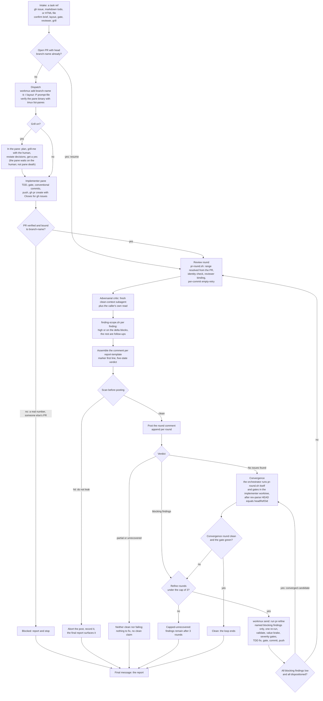
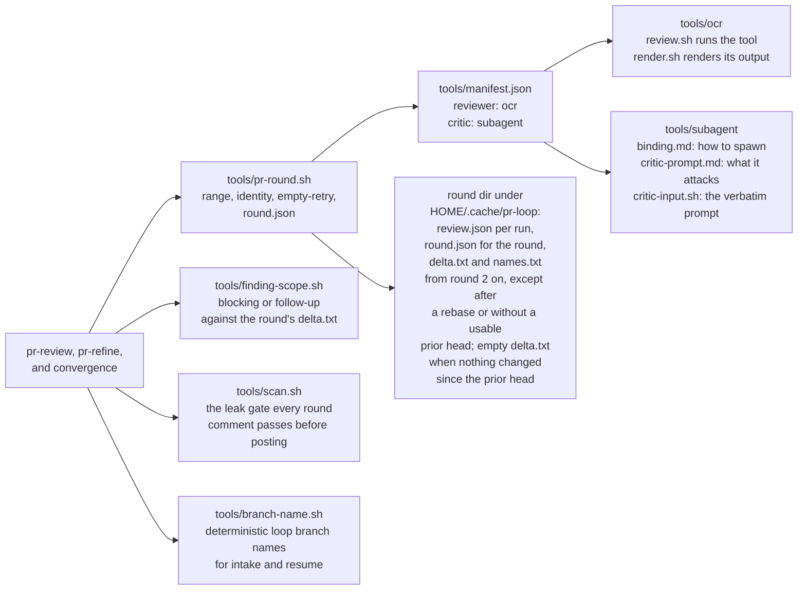

# The issue-to-PR loop: flow

One picture of the unattended loop that /issue-to-pr drives and
/pr-review and /pr-refine serve. The skills are the contract; this
diagram is the map. When the two disagree, the skills win and this file
gets fixed.

**Verdict states** (machine-read by the next round):

- `No issues found.` — every source ran and produced no blocking
  finding.
- `<n> finding(s).` — blocking findings exist, counted across the
  sources that ran. A finding blocks when it is high or sits on a line
  changed since the prior round's head; the rest are follow-ups for the
  human, never refine work.
- `partial (the reviewer's coverage has a gap)` — review text exists but
  part of the range went unreviewed; neither clean nor failing; the
  loop cannot declare the branch clean off that round.
- `unrecovered (the reviewer produced no review text)` — neither clean
  nor failing; the loop cannot declare the branch clean off that round.
- `converged (all blocking findings low and dispositioned)` — the
  orchestrator's convergence round only: blocking findings existed,
  every one low and fixed,
  rejected, or accepted with a recorded reason. The loop ends unless a
  human names a finding.

**Loop end states** (the final message, the runner's contract): `clean`,
`converged` (all blocking findings low and dispositioned; accepted
judgment calls listed), `capped-unrecovered` (blocking findings remain
after 3 refine rounds),
`blocked` (pane death after redispatch, no gate, scan hit, or a partial
or unrecovered reviewer with nothing from any source).

## The loop

## The tool slots

The process is fixed; the tools are bindings. A swap is one directory
plus one manifest line, never a skill edit.

## Where things live

| Thing | Path |
|---|---|
| Orchestrator skill | `~/.claude/skills/issue-to-pr/SKILL.md` |
| Review round skill | `~/.claude/skills/pr-review/SKILL.md` |
| Refine round skill | `~/.claude/skills/pr-refine/SKILL.md` |
| Report template | `~/.claude/skills/pr-review/report-template.md` |
| Implementer prompt | `~/.claude/skills/issue-to-pr/dispatch-prompt-template.md` |
| Slot manifest and bindings | `~/.claude/skills/issue-to-pr/tools/` |
| Leak gate | `~/.claude/skills/issue-to-pr/tools/scan.sh` |
| Branch-name tool | `~/.claude/skills/issue-to-pr/tools/branch-name.sh` |
| Finding classifier | `~/.claude/skills/issue-to-pr/tools/finding-scope.sh` |
| Critic prompt builder | `~/.claude/skills/issue-to-pr/tools/subagent/critic-input.sh` |
| Round artifacts | `$HOME/.cache/pr-loop/<owner/repo>/pr-<n>/round-<N>/` |
| Final report | `$HOME/.cache/pr-loop/<owner/repo>/pr-<n>/final-report.md` |
| workmux layouts | `~/.config/workmux/config.yaml` (chezmoi: `dot_config/workmux/config.yaml`) |
| opencode stack agents | `~/.config/opencode/agent/sp.md`, `mp.md` (not chezmoi-managed yet) |
