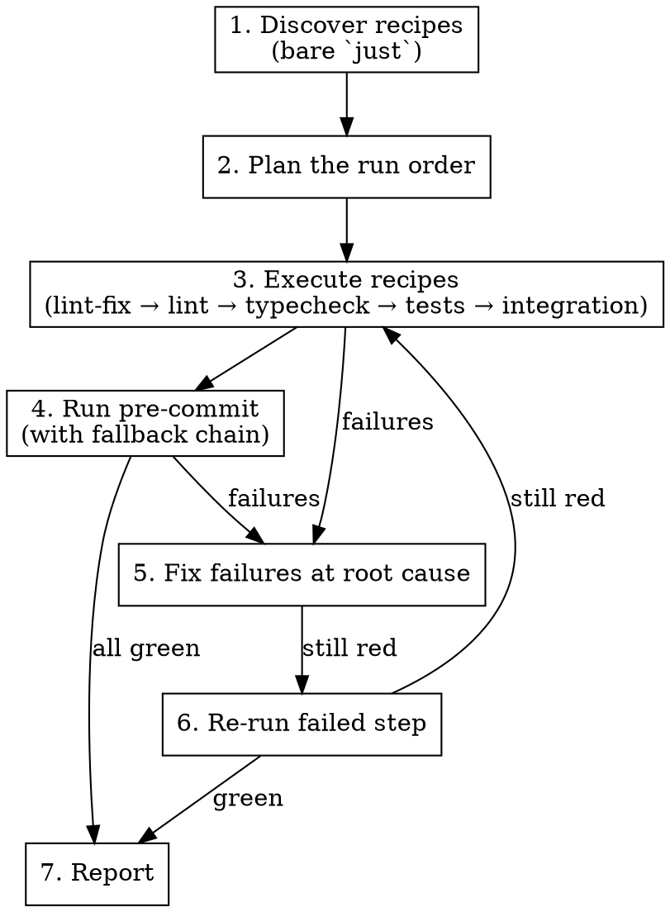

# Preflight

## Overview

Runs the project's quality gauntlet before `git push`. Discovers recipes via `just`, runs them in the right order, runs `pre-commit` (with fallbacks for environments where it is not installed), and fixes failures by addressing their root cause. Never suppresses failures with ignore directives.

## When to Use

- User says `/preflight`, "run preflight", "prepare to push", "ready to push", or similar
- User is about to `git push` and wants a final check
- Before creating a pull request from the current branch

## When NOT to Use

- Before `git commit` — pre-commit hooks already cover that path
- For scaffolding new projects — use `bootstrap-python-project` instead
- When the user wants a partial run (e.g., "just run the tests") — run the specific thing they asked for

## Workflow

### Step 1: Discover Recipes

Run `just` with no arguments. The user has overridden the default recipe to list available commands — parse that output for recipe names.

If there is no `Justfile` / `justfile`, skip recipe discovery and go straight to pre-commit (Step 4).

### Step 2: Plan the Run Order

From the discovered recipes, pick the quality-gate ones. Run in this order when present:

1. `lint-fix` (auto-fix what can be auto-fixed)
2. `lint` (verify remaining)
3. `typecheck` or `types` (if present)
4. `tests` or `test` (unit tests)
5. `integration` or `integration-tests` (if present)
6. Any other recipe whose name clearly signals quality (`check`, `verify`, `ci`)

**Skip** recipes that aren't quality gates: `serve`, `run`, `build`, `install`, `clean`, `fmt` (already covered by lint-fix), `docs`, `release`, etc. When unsure, ask the user rather than running something potentially slow or destructive.

### Step 3: Execute Recipes

Run each recipe with `just <name>`. Capture stdout + stderr. Stop on the first failing recipe and proceed to Step 5 before continuing.

### Step 4: Run Pre-commit

Try in order until one works:

1. `pre-commit run --all-files`
2. `uvx pre-commit run --all-files` (when pre-commit is not installed)
3. `uv tool run pre-commit run --all-files` (alternate uv invocation)

If all three fail with "command not found" (no `uv` either), report the environment is missing tooling and stop — do **not** install pre-commit globally or add it to `pyproject.toml`.

Pre-commit often modifies files (isort, black, trailing whitespace). After it runs:
- If files were modified, note which files and tell the user to review and stage them
- Re-run pre-commit to confirm a clean pass

### Step 5: Fix Failures at the Root Cause

**Hard rules — these are non-negotiable:**

- **Never** add `# noqa`, `# noqa: <code>`, `# type: ignore`, `# ruff: noqa`, `# pragma: no cover`, or equivalent suppressions
- **Never** add entries to `[tool.ruff.lint.per-file-ignores]`, `[tool.ruff.lint.ignore]`, `[tool.mypy]` `ignore_errors`, or equivalent config-level suppressions in `pyproject.toml`, `setup.cfg`, or `.ruff.toml`
- **Never** disable a test, delete a test, or mark it `@pytest.mark.skip` / `xfail` to make the suite pass
- **Never** lower coverage thresholds or relax quality gates in config

**What to do instead:**

- **Lint failures** → fix the code: rename variables, fix imports, tighten types, remove unused code, refactor long functions
- **Type failures** → add proper type hints, narrow types, fix actual type mismatches
- **Test failures** → read the assertion, understand what the code *should* do, fix the code. Fix the test only if the test itself is wrong and the user has confirmed the behavioral change is intentional
- **Pre-commit formatter churn** → accept the reformat, stage it
- **If a failure cannot be fixed without a suppression** (e.g., a legitimate false positive, third-party type stub gap) → stop and ask the user how to proceed. Do not guess.

### Step 6: Re-verify

After fixes, re-run the failing step. If green, continue to the next step in the pipeline. If still red, fix again. If you loop more than twice on the same failure without progress, stop and report — something is wrong with the approach.

### Step 7: Report

Final summary:

- **Ran**: list of recipes + pre-commit outcome
- **Fixed**: what changed during the run (with files modified)
- **Blocked**: any remaining failures, why, and what the user needs to decide
- **Push readiness**: explicit "ready to push" / "not ready — see blockers"

Do **not** run `git push` automatically. The skill prepares; the user pushes.

## Common Mistakes

- **Running `just` recipes that aren't quality gates** (e.g., `just serve` starts a dev server and blocks) — always filter by recipe intent
- **Suppressing to pass** — defeats the purpose of the gauntlet; always fix the root cause
- **Installing pre-commit globally** — use `uvx` / `uv tool run` fallbacks; never `pip install pre-commit` or modify `pyproject.toml`
- **Committing or pushing automatically** — the skill prepares, the user decides to push
- **Ignoring file modifications from pre-commit** — formatters make changes that must be reviewed and staged before push
